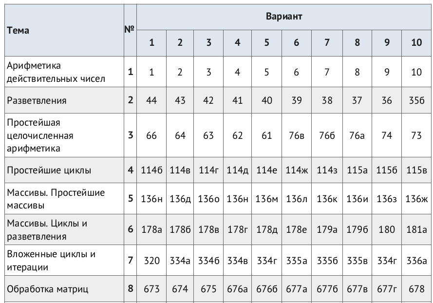

## Лекция 2
- Python
    - numpy массивы. операции
    - Изменяемые и не изменяемые типы. Параметры-ссылки и параметры-значения.
    - Документирование функций. Анонимные функции. 
    - Классы.
    - matplotlib. seaborn
    - Слайды: 
        - https://github.com/ivtipm/computer-simulation/blob/master/Python_math.pdf
        - https://github.com/ivtipm/computer-simulation/blob/master/Python_Data_visualization.pdf
 -  Верификация программ?

## Лекция 1
- Списки в Python. Генераторы списков
- Слайды: 
    - https://github.com/VetrovSV/Programming/blob/master/Programming_03.pdf
    - https://github.com/VetrovSV/Programming/blob/master/Programming_04.pdf
    - https://github.com/VetrovSV/Programming/blob/master/Programming_07.pdf
- Множества, Словари
- Изменяемые и неизменяемые типы данных
- массивы numpy, инексация
- установка пакетов
- см. примеры в Discord
-

# Практика 1

**Python** -- язык программирования общего назначения с большой коллекцией библиотек написанных на разных языках программирования.
Благодаря этому и ориентации языка на продуктивность разработка Python широко используется для научных вычислений и визуализации данных. 
Библиотеки для математических вычислений скомпилированы и содержат оптимизированный код. Некоторые библиотеки дают доступ к распараллеливанию вычислений на GPU.

В течении курса Python будет использоваться для вычислений на GPU и визуализации.

Для того чтобы освоить базовые элементы синтаксиса языка программирования решите несколько задач.

Задачник -- https://ivtipm.github.io/Programming/Files/spisocall.htm

- Все алгоритмы (поиск элемента в последовательности, сортировка, нахождения минимума и максимума и т.п.) требуется реализовывать самостоятельно.
- Для задач 5-8 создайте отдельные модули (или один) с набором функций.
- В задаче 8 для хранения матрицы используйте тип ndarray из библиотеки numpy.
- Документируйте код. Оставляйте комментарии для себя. Соблюдайте cстандарт оформления кода https://pep8.ru/doc/pep8/

Рекомендованная среда разработки - PyCharm

