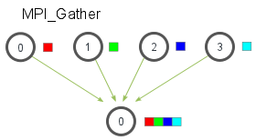

# MPI
Системы с общей памятью трудно масштабировать: например чтобы увеличить количество || выполняющихся потоков нужно увеличить число ядер процессора или число процессоров. Такой способ масштабирования по техническим причинам сильно ограничен.

Системы с распределённой памятью масштабировать проще, нужно только добавить новое устройство в сеть.

## Системы с распределённой памятью
- Массивно-параллельные системы (MPP)\
  состоит из однородных вычислительных узлов: процессор + локальная память + сетевой адаптер.

- кластер\
  Набор рабочих станций (или даже ПК) общего назначения, используется в качестве дешевого варианта массивно-параллельного компьютера. Для связи узлов используется одна из стандартных сетевых технологий (Fast/Gigabit Ethernet, Myrinet) на базе шинной архитектуры или коммутатора
- ...

## MPI


Message Passing Interface (MPI, интерфейс передачи сообщений) — программный интерфейс (API) для передачи информации, который позволяет обмениваться сообщениями между процессами, выполняющими одну задачу.

- Используется в || алгоритмах с распределённой памятью.

- Основным средством коммуникации между процессами в MPI является передача сообщений друг другу.

- Существуют реализации для языков Фортран 77/90, Java, C, C++

- Первая версия MPI разрабатывалась в 1993—1994 году, и MPI 1 вышла в 1994.

- Версия MPI 3.1 вышла в 2015 году.

- MPI 4.0 должен появится в 2021 году.

- существует большое число реализаций, как бесплатных (MPICH, OpenMP) так и коммерческих (Intel MPI)

- MPICH разрабатывается в Аргоннской национальной лаборатории США, с участием компаний IBM, Cray, SiCortex, Microsoft, Intel, ...

- можно запускать в локальной сети или даже на локальном компьютере.

- https://www.mpi-forum.org/
  - новые версии MPICH доступны только для Linux.

### Скачать
https://www.mpich.org/downloads/

Установка в Ubuntu:
`apt install mpich`

### API

- Коды ошибок https://www.mpi-forum.org/docs/mpi-2.2/mpi22-report/node192.htm#Table6

Любая     программа должна в начале содержать вызов `MPI_Init(int* argc,     char*** argv)` -- инициализация. Все последующие функции MPI могут быть вызваны только после MPI_Init.

После инициализации MPI все активные процессы объединяются в общую группу с единым коммуникатором MPI_COMM_WORLD (коммуникатор создаваемый по умолчанию).
Под коммуникатором в MPI принято понимать специально создаваемый служебный объект,
который объединяет в своем составе группу процессоров и ряд дополнительных
параметров, которые необходимы для организации обменов внутри этой группы.

`int MPI_Comm_size( MPI_Comm comm, int *size )` -- определяет общее количество процессов в группе.
`comm` -- коммуникатор (например MPI_COMM_WORLD).
`size` -- после вызова будет содержать количество процессов.

`int MPI_Comm_rank(MPI_Comm comm, int *rank)` --  Determines the rank of the calling process in the communicator.
`rank` -- после вызова будет содержать номер процесса, вызвавшую данную функцию. Нумерация начинается с 0.

`int MPI_Finalize(void)` -- должна быть в конце каждой MPI программы. После неё нельзя вызывать MPI функции.


### Hello, World!
```C++
#include <mpi/mpi.h>

using namespace std;

int main()
{
    MPI_Init(nullptr, nullptr);

    // Get the number of processes
    int world_size;
    MPI_Comm_size(MPI_COMM_WORLD, &world_size);

    // Get the rank of the process
    int world_rank;
    MPI_Comm_rank(MPI_COMM_WORLD, &world_rank);

    // Get the name of the processor
    char processor_name[MPI_MAX_PROCESSOR_NAME];
    int name_len;
    MPI_Get_processor_name(processor_name, &name_len);

    // Print off a hello world message
    printf("Hello world from processor %s, rank %d out of %d processors\n",
               processor_name, world_rank, world_size);

    // Finalize the MPI environment.
    MPI_Finalize();
}
```

### Компиляция и запуск
Далее будет рассмотрена реализация MPICH.

mpicc\mpic++ -- обёртки над компиляторами C и C++.

Показать подробности\
`mpi++ -compile_info`

Коспиляция программы\
`mpic++ main.cpp -o main`\
`-o main` -- указание имени выходного файла


Запуск MPI программ на локальной машине\
`mpiexec -np 5 ./main`\
`-np 5` -- указание числа процессов (5)


После имени программы можно указать её параметры
`mpiexec -np 5 ./main 99999999`

Возможен одновременный запуск нескольких различныйх программ
`mpiexec -np 4 ./app1 : -np 4 ./app2`

Вывод программны
```
Hello world from processor s-pc, rank 1 out of 5 processors
Hello world from processor s-pc, rank 3 out of 5 processors
Hello world from processor s-pc, rank 0 out of 5 processors
Hello world from processor s-pc, rank 4 out of 5 processors
Hello world from processor s-pc, rank 2 out of 5 processors
```

После указания имени исполняемого файла для mpiexec можно передать параметры коммандной строки MPI программе.

см. также [mpiexec vs mpirun](https://stackoverflow.com/questions/25287981/mpiexec-vs-mpirun)

### Передача сообщений

Сообщение - некоторые данные.

Сообщения передаются через специальные буферы: буфер обмена, приёма, передачи.

**Буфер**:
- адрес начала буфера
- число передаваемых элементов
- тип пересылаемых элементов


Типы данных в MPI:
https://www.mcs.anl.gov/research/projects/mpi/mpi-standard/mpi-report-2.0/node229.htm
```
MPI datatype          C datatype      C++ datatype
MPI::INT              signed int      signed int
MPI::UNSIGNED_LONG    unsigned long   unsigned long int
MPI::DOUBLE           double          double
...
```

```C++
MPI_Send(
    void* data,
    int count,
    MPI_Datatype datatype,
    int destination,
    int tag,
    MPI_Comm communicator)
```


- `buf`
    initial address of send buffer (choice)
- `count`
    number of elements in send buffer (nonnegative integer)
- `datatype`
    datatype of each send buffer element (handle)
- `dest`
    rank of destination (integer)
- `tag`
    message tag (integer)
- `comm`
    communicator (handle)

```C++
MPI_Recv(
    void* data,
    int count,
    MPI_Datatype datatype,
    int source,
    int tag,
    MPI_Comm communicator,
    MPI_Status* status)
```


- `count`
    maximum number of elements in receive buffer (integer)
- `datatype`
    datatype of each receive buffer element (handle)
- `source`
    rank of source (integer); MPI_ANY_SOURCE -- принимать от всех.
- `tag`
    message tag (integer); MPI_ANY_TAG -- принимать сообщения с любым идентификатором.
- `comm`
    communicator (handle)

Вызов функций -- блокирующий. Принимать сообщения можно от любого процесса, но отправлять только на конкретный.

Если буфер приёма не способен вместить сообщение, то программа аварийно завершится.

Отправляемое сообщение может быть меньше буфера приёма.

Сообщения отправляются и принимаются через сетевое соединение.

**Пример**. Передача значения переменной
```C++
// Find out rank, size
int world_rank;
MPI_Comm_rank(MPI_COMM_WORLD, &world_rank);
int world_size;
MPI_Comm_size(MPI_COMM_WORLD, &world_size);

int number;
if (world_rank == 0) {
    number = -1;
    MPI_Send(&number, 1, MPI_INT, 1, 0, MPI_COMM_WORLD);
} else if (world_rank == 1) {
    MPI_Recv(&number, 1, MPI_INT, 0, 0, MPI_COMM_WORLD,
             MPI_STATUS_IGNORE);
    printf("Process 1 received number %d from process 0\n",
           number);
}
```

**Пример**\
Какое число будет выведено на экран?
```C++
#include <iostream>
#include "mpi.h"
int main (int argc, char **argv)
{
 int rank;
 MPI_Status status;
 MPI_Init( &argc, &argv );
 MPI_Comm_rank( MPI_COMM_WORLD, &rank );

 int a[5];
 a[0] = 10;
 a[1] = rank;
 if (rank == 1)  
    MPI_Send (&a[1], 1, MPI_INT, 0, 99, MPI_COMM_WORLD);
  else   {
    MPI_Recv(&a[0], 1, MPI_INT, 1, 99, MPI_COMM_WORLD, &status);
    std::cout << a[0];
 }
 MPI_Finalize();
}
```

Как будет выглядеть дедлок вызванный комбинацией функций получения и отправки?

Сообщения могут отправлятся непосредственно адресату (большие сообщения) или записыватся во временный бефер (маленькие сообщения). Тогда функция отпрвки сообщения может завершится раньше, чем функция приёма начнёт своё работу.


**Режимы передачи**
- **B**. с буфферизацией. `MPI_Bsend`
- **S**. синхронный. Процесс получатель должен (для функции отправки) подтвердить готовность получать данные, тогда функция отправки завершит свою работу. `MPI_Ssend`
- **R**. по готовности. функция отправки не начнёт свою работу до получения подтверждения о начале приёма. `MPI_Rsend`


### Измерение времени
`double MPI_Wtime()` -- возвращает время в секундах, прошедшее с некоторого момента в прошлом.


### Запуск на нескольких узлах в сети
Подготовка кластера: https://mpitutorial.com/tutorials/running-an-mpi-cluster-within-a-lan/#step-4-setting-up-nfs
- один из компьютеров кластера должен быть главным -- на нём запускается программа (и заодно MPI сервер)
```bash
mpiexec -np <number of processes> -hosts ip_host1,ip_host2 ./your_program [your_program-parameters]
```

- запускаемая программа должна находится по одинаковому пути на всех узлах кластера (поэтому рекомендуется настроить NFS, создавать одинаковых пользователей). Иначе ошибка `unable to change wdir to ...`

- главный узел управляет подчинёнными по ssh (но допускаются и другие способы), поэтому нужно:  
  - установить ssh сервер на всех подчинённых узлах: `sudo apt install openssh`,
  - организовать доступ к ним по криптографическому ключу (а не по паролю)
  ```bash
  # создать пару криптографических ключей для подключения к узлам
  ssh-keygen
  # скопировать открытый (.pub) ключ на все подчинённые узлы
  ssh-copy-id -i файл-ключа.pub username@remote-node-ip
  # протестировать ssh подключение (и добавить отпечаток ключа удалённого сервера в список доверенных)
  ssh username@remote-node-ip
  ```
- запустить программу через mpiexec на главном узле

<!-- - *подчинённые узлы должны уметь найти главный узел по его имени (имени компьютера), поэтому нужно записать IP главного узла и его имя в hosts файл каждого подчинённого узла. Иначе ошибка: `unable to get host address for computer-name`. -->

- на всех узлах кластера должна быть установлена одна и та же версия MPICH. Проверить версию: `mpichversion`


Ручное указание IP адресов кластера можно заменить на текстовый файл, содержащий перечень этих адресов (https://wiki.mpich.org/mpich/index.php/Using_the_Hydra_Process_Manager#Quick_Start):

```bash
mpiexec -n 7  -f cluster-nodes.list ./main 5000000000
```

Файл со списком узлов cluster-nodes.list:
```
ip_host1
ip_host2
```

Дополнительно в файле можно указать количество процессов, которое запустится на каждом узле
```
ip_host1:3  # число процессов указывается после :
ip_host2:4
```

**Запуск кластера на узлах вне одной локальной сети**

1. Организовать VPN (https://averagelinuxuser.com/linux-vpn-server/)
  1. Установить OpenVPN на один из узлов\
    - установка в Ubuntu\
    `sudo apt install openvpn curl`
    - скачать скрипт для быстрой установки и настройки VPN сервера
    ```bash
    curl -O https://raw.githubusercontent.com/Angristan/openvpn-install/master/openvpn-install.sh
    chmod +x openvpn-install.sh
    ```
    - запустить скрипт установки и настройки: `sudo ./openvpn-install.sh`. Почти все настройки (будет запущен текстовый мастер установки) можно оставить неизменными.
    - в процессе установки указать (client name) имя конфигурационного файла (yнапример `my-config`). Этот файл с расширением .ovpn будет использоваться для подключения клиентов к VPN серверу.
    - скопировать .ovpn файл на остальные узлы кластера

  1. Подключить клиентские VPN приложения к этому серверу
  - подключить каждый узел кластера к VPN:\
  `sudo openvpn my-config.ovpn`

1. Запустить распределённые вычисления, указав в параметре `-hosts` IP адреса узлов виртуальной сети (VPN)

**Пример**. Распределения вычислений числа Pi методом Монте-Карло\
https://github.com/ivtipm/ProcessCalculus/blob/master/examples/MPI-pi-monte-carlo/main.cpp


## Коллективные операции: барьерная синхронизация, распределение и сбор данных

`MPI_Barrier`. Процесс, вызвавший эту функцию, приостанавливает своё выполнение до тех пор, пока все остальные процессы так же не вызовут эту функцию.

**Широковещательная рассылка данных**
`MPI_Bcast` -- процесс с номером root рассылает сообщение из своего буфера передачи всем процессам области связи коммуникатора comm.

```C++
    int MPI_Bcast(void* buffer, int count, MPI_Datatype datatype, int root,
    MPI_Comm comm )
```
- блокирующая функция
- нельзя получить данные с помщью MPI_Recv


**Сбор данных**
- `MPI_Gather` -- производит сборку блоков данных, посылаемых всеми процессами группы, в один массив процесса с номером root. Длина блоков предполагается одинаковой. Объединение происходит в порядке увеличения номеров процессов-отправителей. То есть данные, посланные процессом i из своего буфера sendbuf, помещаются в i-ю порцию буфера recvbuf процесса root. Длина массива, в который собираются данные, должна быть достаточной для их размещения.
```C++
int MPI_Gather(void* sendbuf, int sendcount, MPI_Datatype sendtype,   // буф. отправки
    void* recvbuf, int recvcount, MPI_Datatype recvtype,              // буф. приёма
    int root,                                                        // номер. проц. для сборки данных
    MPI_Comm comm)
```



- `MPI_Allgather` -- то же самое, что и MPI_Gather, но данные собираются на всех процессах
- `MPI_Gatherv`
- `MPI_Allgatherv`.


`MPI_Scatter` разбивает сообщение из буфера посылки процесса root на равные части размером sendcount и посылает i-ю часть в буфер приема процесса с номером i (в том числе и самому себе). Процесс root использует оба буфера (посылки и приема), поэтому в вызываемой им подпрограмме все параметры являются существенными. Остальные процессы группы с коммуникатором comm являются только получателями, поэтому для них параметры, специфицирующие буфер посылки, не существенны.
```C++
int MPI_Scatter(const void *sendbuf, int sendcount, MPI_Datatype sendtype,    // буф. отправки
                void *recvbuf, int recvcount, MPI_Datatype recvtype,          // буф. приёма
                 int root,
                 MPI_Comm comm)
```
- `sendbuf`
    address of send buffer (choice, significant only at root)
- `sendcount`
    number of elements sent to each process (integer, significant only at root)
- `sendtype`
    data type of send buffer elements (significant only at root) (handle)
- `recvcount`
    number of elements in receive buffer (integer)
- `recvtype`
    data type of receive buffer elements (handle)
- `root`
    rank (id) of sending process (integer)
- `comm`
    communicator (handle)


См. также `MPI_Scatterv`


##### Пример
Вычисление суммы двух массивов
```C++
#include "mpi.h"
#include <iostream>
using namespace std;
int main(int argc, char **argv)
{
	int rank, size;
	MPI_Init(&argc, &argv);
	MPI_Comm_size(MPI_COMM_WORLD, &size);
	MPI_Comm_rank(MPI_COMM_WORLD, &rank);

	int const n = 10;
	int n1 = n / size;
	int a[n],  b[n],  c[n];
	int a1[n], b1[n], c1[n];

	// Заполнение массивов
	if (rank == 0)
		for (int i = 0; i < n; i++)			
		{
			a[i] = rand() % 10;
			b[i] = rand() % 10;
		}		
    // Распределение данных с нулевого процесса
	MPI_Scatter(&a[0], n1, MPI_INT, &a1[0], n1, MPI_INT, 0, MPI_COMM_WORLD);
	MPI_Scatter(&b[0], n1, MPI_INT, &b1[0], n1, MPI_INT, 0, MPI_COMM_WORLD);

	// Вычисления
	for (int i = 0; i <= n1; i++)
		c1[i] = a1[i] + b1[i];

	// Сбор данных на нулевом процессе
	MPI_Gather(&c1[0], n1, MPI_INT, &c[0], n1, MPI_INT, 0, MPI_COMM_WORLD);

	//Выдача результатов
	if (rank == 0) {
		cout << "        a[i]  b[i]  c[i]" << endl;
		for (int i = 0; i < n; i++)
		{
			cout << " i= " << i << "     " << a[i] << "     " << b[i] << "     " << c[i] << endl;
		}
	}

	MPI_Finalize();
	return 0;
}
```

**Функции редукции**
```C++
int MPI_Reduce(void* sendbuf,   // буф. отправки
  void* recvbuf, int count,     // буф. приёма
MPI_Datatype datatype, MPI_Op op, int root, MPI_Comm comm)
```

-	sendbuf 	адрес посылающего буфера (альтернатива) 	
- recvbuf 	адрес принимающего буфера (альтернатива, используется только корневым процессом) 	
- count 	количество элементов в посылающем буфере (целое) 	
- datatype 	тип данных элементов посылающего буфера (дескриптор) 	
- op 	операция редукции
  - MPI_OP_NULL
  - MPI_MAX
  - MPI_MIN
  - MPI_SUM
  - MPI_PROD
  - MPI_LAND
  - MPI_BAND
  - MPI_LOR
  - MPI_BOR
  - MPI_LXOR
  - MPI_BXOR
  - MPI_MINLOC
  - MPI_MAXLOC
  - MPI_REPLACE
- root 	номер главного процесса (целое) 	
- comm 	коммуникатор (дескриптор)


**Пример**
Вычисление скалярного произведения двух векторов
```C++
#include <iostream>
#include <mpi.h>
#include <cmath>

int main(int argc, char **argv) {
  MPI_Init(&argc, &argv);

  int rank, size;
  MPI_Comm_rank(MPI_COMM_WORLD, &rank);
  MPI_Comm_size(MPI_COMM_WORLD, &size);

  // The initial values, u_i = i^2; v_i = log(i+1)
  float u_i = rank*rank;
  float v_i = log(rank+1.0);

  // Computing the intermediate value
  float tmp = u_i * v_i;

  // Reducing on process 0 :
  float result;
  MPI_Reduce(&tmp, &result, 1, MPI_FLOAT, MPI_SUM, 0, MPI_COMM_WORLD);

  if (rank == 0) {
    std::cout << "The reduced value is " << result << std::endl;

    // Checking the result
    float validation = 0.0f;
    for (int i=0; i < size; ++i)
      validation += i*i * log(i+1.0f);

    std::cout << "Validation gives the value : " << validation << std::endl;
  }

  MPI_Finalize();

  return 0;
}
```


## Дополнительные материалы:
https://anl.app.box.com/v/2019-06-21-basic-mpi


# ***
```bash
sudo apt update
sudo apt upgrade
sudo apt install mpich openssh-server zsh nano

```


# Ссылки
  - https://mpitutorial.com/tutorials/
  - https://wiki.mpich.org/mpich/index.php/Category:Design_Documents
