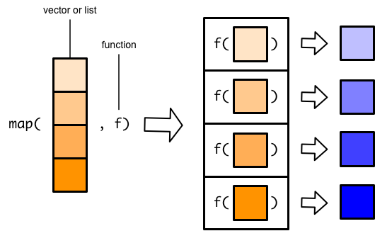
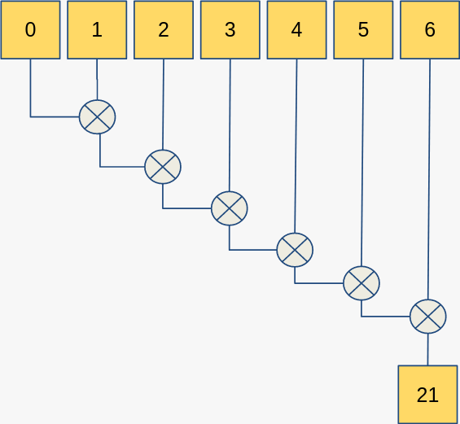
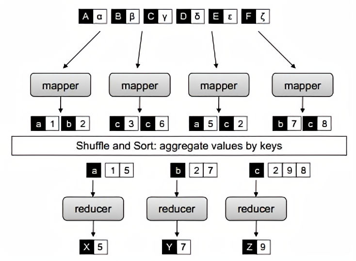
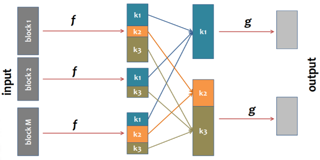
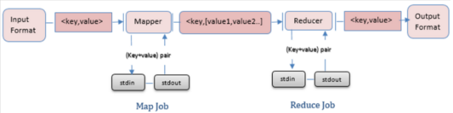

# MapReduce
**MapReduce** — модель распределённых вычислений, представленная компанией Google, используемая для параллельных вычислений над очень большими, вплоть до нескольких петабайт, наборами данных в компьютерных кластерах.


**Map** -- в функциональном программировании процедура применящая нужную функцию к каждому элементу списка

```Python
map(function, iterable, [iterable 2, iterable 3, ...])

# вычислить длины всех строк
result = list( map( len, ['abc', 'hello', 'wtf!?']) )
print( result )
```



**Reduce** (cвёртка списка, accumulate) — функция высшего порядка, которая производит преобразование структуры данных к единственному атомарному значению при помощи заданной функции.

 \

Как отработают эти два вримера?
```python
map(lambda x: x+1, range(5))

reduce(lambda x,y: x+y, range(5))
```

## Стадии MapReduce

Схема MapReduce немного сложнее, чем последовательное применение последовательное map к исходным данным и reduce к результатам map: на каждом этапе работа идёт не с отдельными значениями, а с парами ключ-значение.

1. Чтение: (k1, v1), (k2, v2), ...
1. Map: [(k1, v1), (k2, v2), ...]  -- преобразвание пары ключ-значение; как правило объём данных на входе в mapper больше чем на выходе.
1. Sort: группировка по ключам k2 и сортировка
1. Reduce: (k2, [v2...]) –> (k3, v3)


*map в примере выше выполняет некую абстрактную операцию, а что делает reduce?*

**Пример**. Подсчёт частоты слов в тексте\
Входные данные: текст.\
`I like football but I don't like chess`\

1. Mapper: `(-, line)` -> `[(I, 1), (like, 1), … ] (chess, 1)` *-- предварительная обработка текста*
1. Sort: `[ (word, 1) ]` -> `(I, [1, 1]), (like, [1, 1]), …`
1. Reducer: `[word, [1,1,1,] ]` -> `[ (I, 2), (like, 2) … ]`


**Задача**
Для лога\
`hdfs dfs -cat /data/user_logs/user_logs_M/logsM2.txt | head
`
содержащего записи вида
```
3.49.147.16    20140101014611    http://news.rambler.ru/3105700    378    431    Safari/5.0 (compatible; MSIE 9.0; Windows NT 6.1; Win64; x64; Trident/5.0; .NET CLR 3.5.30729;)
197.72.248.141    20140101020306    http://news.mail.ru/6344933    1412    203    Safari/5.0 (compatible; MSIE 9.0; Windows NT 6.1; WOW64; Trident/5.0; .NET CLR 3.5.30729; .NET CLR 3.0.30729;
33.49.147.163    20140101023103    http://lenta.ru/4303000    1189    451    Chrome/5.0 (compatible; MSIE 9.0; Windows NT 6.1; Win64; x64; Trident/5.0)
```

Определить сколько раз каждый пользователь (IP) посетил сайт mail.ru?

1. Mapper: `(-, line)` -> `[ (IP, 1) ]`
1. Sort: `[ (IP, 1) ]` -> `[ (IP, [1,...,1]) ]`
1. Reducer: `[ (IP, [1,...,1]) ]` -> `[ (IP, n) ]`


Применение в распределённых системах хранения и обработки данных


**Приемущества**
1. Подходит для широкого круга задач
1. Легко параллелится
1. Легко масштабируется


#### Hadoop Streaming


Mapper и reducer – программы, команды или Java-класс
- Читают из stdin, пишут в stdout
- Sort & shuffle обеспечивает hadoop
- Reducer вызывается один на одну reduce-
задачу

# См. также
- подробная схема MapReduce: https://i1.wp.com/0x0fff.com/wp-content/uploads/2014/12/MapReduce-v3.png
- BigData
  - хранение: HDSF
  - обработка: hadoop
