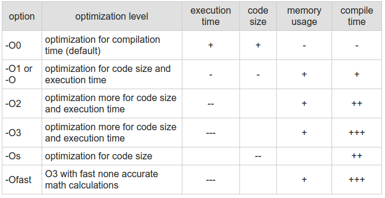

# OpenMP

OpenMP (Open Multi-Processing) — открытый стандарт для распараллеливания программ на языках C, C++ и Фортран.

См. также https://ru.wikipedia.org/wiki/Intel_Threading_Building_Blocks

Даёт описание совокупности директив компилятора, библиотечных процедур и переменных окружения, которые предназначены для программирования многопоточных приложений на многопроцессорных системах с общей памятью.

- Разработка стандарта ведётся некоммерческой организацией OpenMP Architecture Review Board (ARB), в которую входят все основные производители процессоров, а также ряд суперкомпьютерных лабораторий и университетов

- Поддерживается многими современными компиляторами (входит в стандартную поставку). [https://www.openmp.org/resources/openmp-compilers-tools/]

- Сильно упрощает создание потоков и распределение между ними вычислений для уже написанного кода.

- SPMD (Single Program Multiple Data) подход, подвид MIMD в классификации Флинна.\
  Все процессы (или потоки) выполняют одну и ту же код (программу), но каждый — над разными участками данных. Используется для организации параллельной обработки без необходимости писать отдельный код для каждой задачи. См. пример ниже.

- Последняя версия (на апрель 2025) - 6.0.

- Входит в дистрибутив большинства компиляторов C, С++, Fortran;

Вычисления распараллеливаются между несколькими потоками, включая основной (master) поток:


Это *fork-join* подход к организации параллелизма — вилочный параллелизм. Где fork — создание новых потоков, join — ожидание завершения потоков.

При этом потоки могут быть логически вложенными друг в друга.

## Устройство OpenMP

OpenMP состоит из трёх компонентов:
- директивы компилятора (`#pragma omp ...`)
- переменные среды окружения (можно задавать в командной строке)\
   например.
   windows: `set OMP_NUM_THREADS = 8`\
   linux: `export OMP_NUM_THREADS=8`
- вспомогательные (библиотечные) функции; описаны в omp.h


Логические части OpenMP


<br>

<br>

**Структура директивы**
```C++
#pragma omp <directive-name> [опция1, опция2]
```

Такая директива влияет на следующей за ней оператор или блок операторов.

Пример. fork-join
```C++
#include <omp.h>

int main(){
  // последовательный код
  #pragma omp parallel
     {  // (1)
        // параллельный код
     }  // (2)
 // последовательный код

 return 0;}
```


`// (1)` — fork:
1. создание функции на основе блока кода
2. создание нескольких потоков
3. запуск потоков с функцией выполнения

`// (2)` — join
1. Ожидание завершения всех потоков.

### Компиляция программы
С++, gcc:

```bash
g++ main.cpp -fopenmp -o myprog
```
- `-fopenmp` -- флаг: подключить OpenMP и другие нужные OpenMP библиотеки (*.lib или .a файлы).
-o myprog -- имя исполняемого файла -- `myprog`


**Включить поддержку OpenMP в IDE**
- Qt Creator.
 в pro файл добавить: `QMAKE_LFLAGS +=  -fopenmp`
- Visual Studio. Свойства проекта > С\С++ > Все параметры > поддержка OpenMP

В секции параллельного блока можно вызвать функцию получающую номер потока. В зависимости от номера потока выполнять ту или иную работу.
```C++
#include <omp.h>

int main(){
  // последовательный код
  #pragma omp parallel
     {
    // получение номера потока
    int i = omp_get_thread_num();
    // ...
    }
 // последовательный код

 return 0;}
```


**Пример подхода SPMD (Single Program, Multiple Data)**
Задача: Возведение всех элементов массива в квадрат

```cpp
#include <omp.h>
#include <iostream>
#include <format>

using namespace std;

int main(){
    
    const size_t N = 1'000'000;
    int * a = new int [N];

    for (size_t i = 0; i< N; i++) a[i] = rand();

    int n_threads = 4;                  // количество потоков  
    omp_set_num_threads( n_threads );   // задание числа потоков для || блока кода #pragma omp parallel
    
    size_t batch_size = N / n_threads;            // минимальынй размер порции данных, которую должен обработать поток
    // данные могут не поделиться на одинаковые порции, поэтому считаем остаток. 
    size_t rem = N % n_threads;     
    // потом остаток распределим по 1 между первыми потоками
    // некоторым потоком 1 не достанется, т.к. остаток всегда меньше делителя (числа потоков)
    
    cout << format("batch_size = {}\n", batch_size);
    cout << format("remainder =  {}\n", rem);
    

    #pragma omp parallel
    {   
        int nth = omp_get_thread_num();     // получение номера потока, нумерация начиняется с нуля

        size_t start = nth*batch_size +   ( (nth < rem)? nth:rem );     // индекс начала блока массива для обработки
        size_t end = start + batch_size + ( (nth < rem)? 1:  0 );       // индекс конца блока массива, не включительно
        
        // для наглядности примера выведем диапазоны блоков массива для каждого потока
        // critacal - создаёт критическую секцию
        #pragma omp critical
              cout<<format("{}: start = [{:7}, end={:7})\n", nth, start, end);

        for (size_t i = start;  i<end;  i++){
            a[i] = a[i]*a[i];
        }
    }
}
```

Пример приведён для демонстрации подхода SPMD. См. ниже более простой пример созданий параллельной версии for.

#### Общие и локальные переменные для потоков
Все переменные, созданные до директивы parallel, являются общими для всех потоков. Переменные, созданные внутри потока являются локальными (приватными) и доступны только текущему потоку.

Общие переменные при этом не потокобезопасны:
```C++
int value = 123;

#pragma omp parallel
{
 value++;
 std::cout << value++ << std::endl;
}
```


### Директивы компилятора для || вычислений
`#pragma omp ... `

Для распараллеливания вычислений:
- `parallel` выполняет область кода параллельно в нескольких потоках;
- `for` 	автоматически распределяет итерации цикла for между параллельными потоками;
- `sections` 	определяет блок кода, который будет выполнен одним произвольным потоком; обычно внутри блока parallel создают несколько блоков sections, чтобы эти блоки выполнялись параллельно;
- `single`\
Гарантирует выполнение блока кода только одним произвольным потоком команды, остальные потоки по умолчанию ждут окончания этого блока, если не указан `nowait`. Полезна для однократной инициализации или ввода-вывода.
  ```cpp
  #pragma omp parallel
  {
      #pragma omp single
      {
          init_shared_resource();
      }
      // остальные потоки ждут, пока ресурс не будет инициализирован
      use_shared_resource();
  }
  ```
- См. также директиву `master`.

*Компилятор может игнорировать опечатки в директивах после слова #pragma.*

#### parallel
```C++
#pragma omp parallel
```
Требования к || участку кода:
- один вход, один выход. Условные переходы из\в || участка кода в последовательный запрещены.
- внутри || участка кода может быть вызвана функция

Явное задание числа потоков \
   ```... num_threads( 12 )```

Задать число потоков можно с помощью:
- переменной среды окружения `OMP_NUM_THREADS`. Это значение имеет низший приоритет.
- функции `omp_set_num_threads()`. Средний приоритет.
- директивы `num_threads( )`. Высший приоритет, но только для последующей || области

#### Вложенный параллелизм

Разрешить вложенный параллелизм :
- переменная среды окружения: `OMP_NESTED = true`
- функция `omp_set_nested( true )`


##### См. также
- условный параллелизм
```С++
#pragma omp parallel if ( x > 5)
```

#### section
Количество разделов `section` внутри `section` определяет количество параллельных потоков.
```C++
#pragma omp parallel sections
{
    #pragma omp section
    {
        printf ("id = %d, \n", omp_get_thread_num());
    }

    #pragma omp section
    {
        printf ("id = %d, \n", omp_get_thread_num());
    }
}
```

#### single
Задаёт участок кода, который будет выполнятся только одним потоком (не известно каким). single имеет смысл приводить только внутри блока кода parallel

В конце single блока используется неявная *барьерная синхронизация* — все потоки будут ждать завершения самого медленного потока:

```
поток 1 =======--------|
поток 2 ===============|
поток 3 ===========----|

выполнение: ===
ожидание: ---
```

Опции:
- `copyprivate( список переменных )`
После завершения, скопирует значения переменных в одноимённые переменные родительской параллельной области. Полезно использовать в середине || области, где встречаются вычисления, которые нельзя распараллелить.

- `nowait` — отменяет барьерную синхронизацию для данной директивы (single, for, parallel)


```C++
#pragma omp parallel
{
    int my_value = 0;       // общая переменная для всех потоков

   // секция кода, выполняемая одним потоком
   #pragma omp single     
    {
        my_value = my_value + 42; // Значение задаётся только в одном потоке 
        // signle
    }
    // my_value = 42;
}
```

#### for
Последующий цикл for должен быть разделён на части и распределён между потоками. Итерации будут распределены между потоками.

Блок с циклом завершается, когда завершается самый медленный поток.

Способы (стратегии) разделения итераций между потоками:
- `static[, chunk]`
  При статическом планировании всё пространство итераций разбивается на чанки (блоки) одинакового размера (или ближайшего к равному) и циклически назначается потокам.

  Например, если итераций 1000, а потоков 4, то первый поток выполнит итерации 1-250, второй - 251-500, третий 501-750, четвёртый - 751-1000. Если номер итерации используется ещё и как индекс, такое разделение даст неплохую локальность данных в рамках одного потока. 

  Если `chunk` не указан, итераций на поток будет примерно `ceil(N/num_threads)`. Это режим block scheduling.

  Если задать `chunk` = 1, то каждый поток будет обрабатывать по одной итерации в карусельном (round robin) порядке. Например, потока три. Итераций - 7.
  0 поток: 0, 3, 6
  1 поток: 1, 4, 7
  2 поток: 2, 5 

  В этой стратегии минимальные накладные расходы, но плохой баланс, если время итераций сильно варьируется.

- `dynamic[, chunk]`
  Потоки запрашивают новые чанки по мере освобождения, что даёт лучший баланс при неравномерной нагрузке: каждый поток получает следующий свободный чанк, когда заканчивает предыдущий 
  По умолчанию `chunk` = 1.
  Возникают накладные расходы из-за более частых синхронизаций.

- `guided[, chunk]`
  Похоже на dynamic, но размер чанка уменьшается экспоненциально от ceil(remaining_iters/num_threads) до chunk
  Снижает накладные расходы динамического метода на больших оставшихся объёмах.
  Подходит при умеренной неравномерности итераций.

- `auto`
  Делегирует выбор стратегии компилятору или системе; может приводить к самым оптимальным решениям на конкретной платформе 


- `runtime`
  Планирование откладывается до выполнения, используется метод, заданный через omp_set_schedule или переменную окружения OMP_SCHEDULE 
  Формат OMP_SCHEDULE: `[modifier:]kind[,chunk]`, где modifier — monotonic или nonmonotonic


**static vs dynamic**
`static` - для одинаковых по времени итераций.
```cpp
#include <omp.h>
#include <vector>

void fill_vector_static(std::vector<int>& v) {
    size_t N = v.size();
    #pragma omp parallel for schedule(static)
    for (size_t i = 0; i < N; ++i) {
        v[i] = i * 2;   // итерации одинаковы по времени 
    }
}
```

`dynamic` - длительность разных итераций существенно различается.
```cpp
#include <omp.h>
#include <unistd.h> // sleep

void work_dynamic(int N) {
    #pragma omp parallel for schedule(dynamic, 1)
    for (int i = 0; i < N; ++i) {
        // симулируем работу, зависящую от i
        sleep(i % 5);
        // реально полезная работа...
    }
}
```


#### master
Заставляет блок кода выполняться исключительно главным (master) потоком с `omp_get_thread_num() == 0`, при этом не создавая неявного барьера в конце в отличии от single. Это удобно, когда нужно, чтобы только главный поток выполнил какую-то работу без остановки остальных.
```cpp
#pragma omp parallel
{
    #pragma omp master
    {
        printf("Only master thread prints this\n");
    }
    // другие потоки не ждут окончания master-блока и могут продолжать работу
    do_work();
}
```

### Раздельное и совместное использование перемеренных
- `shared` - общая переменная - используется по умолчанию для всех глобальных переменных
- `private` - создаёт локальную копию общей переменной для каждого потока, не инициализирует локальные переменные. 
- `firstprivate` -  аналогично `private`, но инициализирует локальные переменные значением глобальной.
- `lastprivate` - аналогично `private`, но значение из последней уничтожаемой из локальных копий будет записано в глобальную переменную. 

- **Общие переменные** — как глобальные переменные, доступны всем потокам. Все переменные, объявленные вне || области считаются общими. Исключения — счётчики циклов.

  ```C++
  #pragma omp parallel shared(A, B, C)
  ```
  Не защищены от неопределённости параллелизма.

- **Локальные переменные** — у каждого потока своя копия переменной. Даже если переменная объявлена в общей области видимости. Начальное значение переменной не определено. Все переменные объявленные в || области считаются локальными.
  ```C++
  int A = -1, b;
  #pragma omp parallel private(A, b)
  {
  A = rand();
  printf("A = %d\n", A);    // будет выведено несколько (по числу потоков) значений
  }

  printf("A = %d\n", A);  // будет выведено -1
  ```

**reduction (операция : список переменных)**
- создаёт инициализированные копии глобальной переменной в каждом потоке
- в конце || секции выполняется указанная операция с локальными копиями, результат записывается в исходные глобальные переменные

#### Директивы компилятора для синхронизации
For master and synchronization:

- `master` 	Specifies that only the master thread should execute a section of the program.

- `critical`\
Cоздаёт критическую секцию, гарантируя, что только один поток выполняет код внутри блока в любой момент времени. В отличие от `atomic`, она может делать потокобезопасным произвольный фрагмент кода, но менее эффективна для простых операций.

```cpp
int max_val = 0;

#pragma omp parallel for
for(int i = 0; i < N; ++i) {
    int local = compute(i);
    #pragma omp critical
    {
        if(local > max_val) max_val = local;
    }
}
```

`barrier`\
Заставляет все потоки дождаться друг друга в точке синхронизации, прежде чем продолжить выполнение дальше. Это полезно, когда необходимо убедиться, что все предшествующие операции завершены перед переходом к следующему этапу.
```cpp
#pragma omp parallel num_threads(3)
{
    // Шаг 1: каждый поток делает свою работу
    compute_part();
    #pragma omp barrier
    // Шаг 2: работа, которая должна начаться только после завершения первого шага всеми потоками
    finalize();
}
```
Все четыре потока остановятся на #pragma omp barrier и продолжат только после того, как последний из них достигнет этой точки

```
compute_part   finalize
=======----- | =====--
============ | ====---
===--------- | =======
           barier
```

`atomic`\
Гарантирует атомарное обновление одной переменной без необходимости захвата полноценной критической секции.
Особенно эффективна для простых операций, таких как инкремент или декремент, поскольку многие архитектуры поддерживают аппаратные атомарные команды

Пример:
```cpp
int sum = 0;
#pragma omp parallel for
for(int i = 0; i < N; ++i) {
    #pragma omp atomic
        sum += a[i];
}
```
Стоит отметить, что приведённый алгоритм будет не эффективным из-за критической секции, в которой совершается сравнительно много работы по сравнению с остальным кодом.


`flush`\
  Cинхронизирует видимость памяти, гарантируя, что до и после директивы все потоки увидят согласованные значения указанных (или всех) глобальных переменных. Это важно если нужно учитывать низкоуровневые эффекты: несогласованности значений переменной из-за обновления значения только в регистре или кэше процессора, т.к. они могут быть у каждого потока свои, в отличии от RAM. `flush` работает только с разделяемыми (shared) переменными.
  ```cpp
    int x = 0;

    #pragma omp parallel num_threads(2) shared(x)
    {
        if (omp_get_thread_num() == 0) {
            // Producer: пишет и сбрасывает значение x
            x = 42;
            #pragma omp flush(x)
        }
        else {
            // Consumer: сбрасывает копию из памяти и читает x
            #pragma omp flush(x);
            printf("x = %d\n", x);
        }
    }
    return 0;
  }
  ```

`ordered`\
  Внутри for-цикла с ordered-условием обеспечивает выполнение указанных блоков в том же порядке, что и итерации в последовательном цикле. При использовании потоки могут продолжать работать параллельно вне ordered-блоков, но упорядоченно входить в них.
  ```cpp
  #pragma omp parallel for ordered schedule(static)
  for(int i = 0; i < N; ++i) {
    process(i);
    #pragma omp ordered
    {
        printf("Iteration %d done in order\n", i);
    }
  }
  ```
  Сообщения будут выведены в порядке возрастания i, несмотря на параллельную обработку.


For data environment:
- `threadprivate` 	Specifies that a variable is private to a thread.

https://docs.microsoft.com/ru-ru/cpp/parallel/openmp/reference/openmp-directives?view=msvc-160


## Векторизация

**Векторизация** — вид распараллеливания программы, при котором однопоточные приложения, выполняющие одну операцию в каждый момент времени, модифицируются для выполнения нескольких однотипных операций одновременно.


```C++
for (i=0; i<n; i++)
   c[i] = a[i] + b[i];
```
Если оператор сложения имеет перегруженную векторную форму, то код можно переписать так:
```C++
c = a + b;
```
Однако, чаще всего такое сложение массивов можно векторизовать частными сложениями отдельных блоков массивов (например по 4 элемента).


- современные компиляторы (с включёнными опциями оптимизации) могут поддерживать автоматическую векторизация.
- автоматическая векторизация может происходить и во время выполнения программы


*Векторные операции в процессоре*
- набор инструкций SSE процессоров intel
- набор инструкций 3DNow! в процессорах AMD

Процессоры поддерживающие векторные операции (все современный процессоры) хранят данные в *векторных регистрах*.

#### Пример
[Пример](examples/auto_vectorization)

Компиляция примера:

| команда компиляции             | время выполнения программы |
|--------------------------------|----------------------------|
| `g++ main.cpp -o main-novec`     | 3536 ms                    |
| `g++ main.cpp -o main-vec   -O3` | 1597 ms                    |

   Компиляция с отчётом о векторизации циклов:\
   `g++ main.cpp -o main-vec -O3 -fopt-info-vec`\
   Вывод:\
   `main.cpp:21:27: optimized: loop vectorized using 16 byte vectors`


Команды компиляция приведены для linux, С++ компилятора GCC. В Windows имя исполняемого файла аналогичного компилятора отличается (см. MinGW)

Флаги компилятора, связанные с векторизацией:
- `-O -fopt-info`             — показать все подробности об оптимизации. не покажет ничего, если оптимизация не производилась
- `-fopt-info-vec`            — показать информации о векторизации циклов
- `-fopt-info-vec-missed`     — показать не векторизованные операции
- `-fopt-info-vec-note`       — Detailed info about all loops and optimizations being done.
- `-fopt-info-vec-all`        — All previous options together.

Опции оптимизации C++ компилятора GCC:\


https://stackoverflow.com/questions/29292818/how-to-vectorize-my-loop-with-g

Документация об оптимизации GCC: https://gcc.gnu.org/onlinedocs/gcc/Optimize-Options.html

**Оптимизация кода в Microsoft Visual C++**: Свойства проекта > раздел С\С++ > оптимизация\
**Передача опций компилятору (GCC) в Qt Creator**: в pro-файле проекта добавить: `QMAKE_CFLAGS += -O3`


#### pragma ivdep, vector always
```#pragma ivdep```\
ivdep – ignore vector dependencies. Изменяет способ принятия решения о возможности векторизации данного цикла: компилятор по-прежнему анализирует все возможные зависимости между данными, но недоказанные зависимости не принимаются во внимание (считаются несуществующими). Таким образом, если существование зависимости доказано, то векторизация произведена не будет, но все недоказанные зависимости более не будут препятствием для векторизации.


Пример рискованной, с точки зрения компилятора векторизации цикла:
```
void sum(float *a, float b*, float *c, float *d, float *e, unsigned n){
 for (unsigned i =0; i<n; i++)
   a[i] = a[i] + b[i] + c[i] + d[i] + c[i];
}
```

В ряде случаев компилятор может счесть, что векторизация возможна, но для данного цикла неэффективна. Если же программист считает, что векторизация все равно будет эффективна, можно дать соответствующую рекомендацию компилятору при помощи `#pragma vector always`. Часто #pragma ivdep и #pragma vector always используются вместе. Важно отметить, что #pragma vector always является лишь рекомендацией и в случае обнаружения зависимости или наличия других веских причин векторизация все равно произведена не будет.

`#pragma simd`
Дает компилятору явное указание произвести векторизацию данного цикла


### pragma omp simd
- то же самое, что и `#pragma simd`, но включённое в стандарт OpenMP


**Опции**
- `safelen( целая константа )` — задаёт максимальное расстояние (в итерациях) между итерациями, которые могут выполняться параллельно

```C++
...
#pragma omp simd safelen(8)
for (unsigned i=8; i<n; i++){
 a[i] = a[i-8]
}
```


- `simdlen ( число )` — предпочтительное число || выполняющихся итераций

- `alignment (список, целое число)`

- `linear ( переменная : положительное число)`


*Ограничения*
Если в цикле вызывается функция, то в общем случае этот цикл не векторизуется. Чтобы избежать этого, отдельные функция можно сделать векторизуемыми

```C++
#pragma omp declare simd
float sum(float a, float b){return a+b;}

#pragma omp simd
for (unsigned i=0; i<n; i++)
 c[i] = sum(a[i], b[i]);
```


## task

Один поток генерирует задачи, другие — выполняют, подход похожий на пулл потоков.

Задача может выполнятся немедленно или спустя некоторое время после её назначения потоку.
Выполнение задачи может быть прервано, а потом продолжено.

Опции:
- shared
- private
- firstprivate
- default
- if
- untied. Если задача была начата одним потоком, то может быть продолжена любым другим потоком. По умолчанию, отложенная задача выполняется тем же потоком, что начинал её выполнение.

**Пример**

Обход списка с выполнением длительных операций над каждым элементом
```C++
#pragma omp parallel
{
    // выдавать задачи должен выдавать один поток. он же будет обходить список
    // nowait — отключить барьерную синхронизацию
    #pragma omp single nowait
    {
      node = list_head;
      while (node){
        // создание задачи, которую будет выполнять другие потоки
        // firstprivate — создание локальной копии переменной в каждом отдельном потоке, выполняющем каждую отдельную задачу.
        // локальная (private) для потока переменная будет инициализирована (first) значением глобальной переменной node
        #pragma omp task firstprivate(node)
        {
            independent_work( node );
        }
        node = node->next;    
      }

    }


}
```

- В чём разница между parallel и task?
- В чём разница между section и task?


#### Дополнительно
Больше примеров опций векторизации:
- https://stackoverflow.com/questions/29292818/how-to-vectorize-my-loop-with-g
- https://hpac.cs.umu.se/teaching/sem-accg-16/slides/08.Schmitz-GGC_Autovec.pdf


## См. также
`#pragma omp traget`


```C++
#pragma omptarget map(to:b,c,d) map(from:a)
// перед циклом переместит переменные b,c,d на отдельное устройство,
// после цикла переместит переменную a с устройства
//
{
 #pragma omp parallel for
   for (i=0; i<count; i++) {
     a[i] = b[i] * c + d;}
}
```

# См. также
- Parallel STL
- Intel TBB

# Ссылки
- https://www.openmp.org//
- https://www.coursera.org/learn/parallelnoye-programmirovaniye/home/welcome
- Документация (MSVC): https://learn.microsoft.com/ru-ru/cpp/parallel/openmp/openmp-in-visual-cpp?view=msvc-170
- Пример: https://github.com/ivtipm/ProcessCalculus/blob/master/examples/openMP_1/main.cpp
