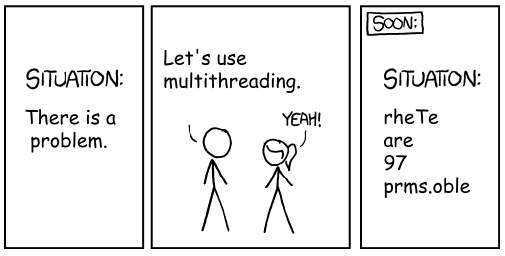
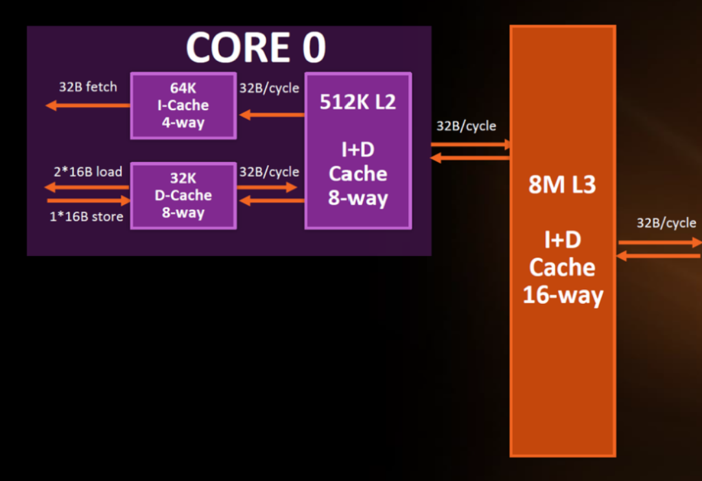

# Лекция 8-9. || программирование (продолжение)



- слайды с прошлой лекции: https://github.com/ivtipm/ProcessCalculus/blob/master/PC.%20lec.%20parallel.pdf

## Повторение
- Зачем?
- Классификация видов параллелизма
- асинхронный?
- parallelism vs concurency
  - в чём преимущество каждого из них
- Закон Амдала
- с чего начать оптимизацию программы?
  - профилирование
  - об оптимизации (https://habr.com/ru/post/309796/)
- Виды || декомпозиции
- атомарная операция
- потоковая безопасность
  - потокобезопасны ли коллекции вашего любимого языка программирования?  (см. домашнюю работу)


- проблемы || программирования и способы их решения
  - состояние гонки (неопределённость параллелизма)
  - взаимная блокировка
  - проблема ABA


## Профилирование производительности кода
- cProfiler: https://github.com/VetrovSV/Programming/blob/master/Programming_optimisation.pdf
- профилирование в PyCharm Professional: https://www.jetbrains.com/help/pycharm/profiler.html#work-with-profiling-results
- профилирование в Visual Studio: https://docs.microsoft.com/ru-ru/visualstudio/profiling/beginners-guide-to-performance-profiling?view=vs-2019

## Задержка обращения к памяти
<!--  -->

Примерный порядок размеров памяти и примерный порядок времени доступа к памяти


Кэши процессора:
- L1 обычно располагается максимально близко к исполнительным блокам ядра. Один на ядро. Делиться на:
  - Кэш инструкций (L1-I, I-Cache)
  - Кэш данных (L1-D, D-Cache)
- L2 обычно один на ядро, но может быть общим для нескольких ядер.
- L3 обычно один на процессоре.

\
AMD Zen Architecture

В эту иерархию памяти, как самый нижний слой, также можно добавить удалённые хранилища данных и сетевые кэши для них. 

- поиск данных в памяти происходит начиная с вершины пирамиды
- если нужные данные в кэше отсутствуют, то они копируются туда из оперативной памяти
- данные копируются блоками (например при обращении к одному элементу массива, могут быть скопированы сразу несколько соседних элементов)

**Рекомендации**
* Старайтесь обрабатывать данные подряд (строки массива, смежные поля в struct).
* Blocking / Tiling – в матричных и свёрточных алгоритмах разбивайте данные на блоки, чтобы всё нужное поместилось в L1/L2.

**Вопрос**\
Почему при одинаковых вычислительных затратах два способа перемножения одних и тех же матриц в программе [examples/performance_and_mem.cpp](examples/performance_and_mem.cpp) занимают разное время?


**Инструменты для анализа и профилирования**
* Valgrind Cachegrind / Linux perf – показывают число попаданий/промахов в разные уровни кэша.
* Intel VTune / AMD μProf – детальные отчёты по задержкам памяти, предсказанию ветвлений и узким местам в конвейере.

***
Программы для кэширования (например веб-запросов) часто хранят данные в оперативной памяти, а не на диске. Например так делает redis.

**Redis** — это быстрая, нереляционная база данных, работающая в оперативной памяти и использующая модель «ключ–значение». Она часто применяется для кэширования, управления сессиями и других задач, где важна высокая скорость доступа к данным


## Многопоточное программирование: синхронизация

- примеры C++ [examples/example_thread/main.cpp](examples/example_thread/main.cpp)
  - проблема функции bar
- пример QThread: [examples/example_qthread](examples/example_qthread)
  - остановка одного потока из другого потока
- примеры в Java: [examples/example_java_threads](examples/example_java_threads), [examples/example_java_thread-gui](examples/example_java_thread-gui)
- пример pyhton:[examples/thread_python/main.py](examples/thread_python/main.py)

- как корректно завершить другой поток?


#### Обновление UI из фонового потока
  - основная функция (метод), которая выполняется в фоновом потоке не должна знать про UI
  - если результаты работы фонового потока не нужны *немедленно*, создайте Таймер, который будет внутри класса окна опрашивать общую с потоком переменную, проверяя есть ли в ней результат
  - в Qt пересылайте сигналы из одного потока в другой
  - используйте *делегаты*
  - сделайте функцию-обёртку
      - эта функция будет вызывать основную функцию вычислений
      - эта функции будет доступен класс главного окна
      - такой подход использовался здесь: [examples/example_java_thread-gui](examples/example_java_thread-gui)

### Aync\Await в C# -- Task-based asynchronous pattern (TAB)

Одна из трудностей || программирования -- синхронизация. В частности такие трудности возникают, если после завершения отдельного потока нужно выполнить действия в текущем потоке, при этом текущий поток не должен блокироваться на время ожидания.

В C# для решения этой задачи используется Task-based asynchronous pattern (TAB): возможность приостановить выполнение текущего метода, создавшего новый поток, до завершения нового потока.


Для этого требуется:
- Чтобы метод был помечен ключевым словом `async`, а внутри содержал вызов с `await`. При этом если метод содержит `await`, обязательно его помечать `async`, обратное неверно, но бессмысленно.
- операция, выполняемая асинхронно, в отдельном потоке, должна возвращать `Task<T>`.


```cs
public static async Task DelayOperationAsync() // асинхронный метод
{
    // ...
    // Моделирование (через задержку) асинхронной операции, выполняемой в отдельном потоке
    Task task = Task.Delay(1000);
    // ...

    // неблокирующее ожидание результатов выполнения асинхронной операции, выполняемой в отдельном потоке
    // при этом метод DelayOperationAsync не заблокирует свой поток на время ожидания,
    // а приостановится. Его состояние будет сохранено. Текущий поток будет выполнять другие методы.
    await task;
    // после того, как будет получен сигнал о завершении асинхронной операции,
    // текущий метод пробудится и выполнится до конца.
}
```

https://habr.com/ru/post/470830/


### Примеры: сети Петри
  - https://github.com/ivtipm/ProcessCalculus/blob/master/examples/example_thread/main.cpp
  - example1
  ``` {"places":["P1,228,138,0","P2,397,138,0","P3,460,308,0","P4,622,226,0","P5,620,140,0","P6,773,310,0","P7,469,224,0","P8,615,309,0","P9,766,229,0","P10,908,133,0","P11,1112,126,0"],"trans":["T1,328,141","T2,467,137","T3,538,312","T4,688,310","T5,540,226","T6,698,225","T7,829,133","T8,1007,130"],"arcs":["P1,T1","T1,P2","T1,P3","P2,T2","T2,P5","P3,T3","T3,P8","T2,P7","T4,P6","P7,T5","T5,P4","P4,T6","P8,T4","T6,P9","P5,T7","P9,T7","T7,P10","P10,T8","P6,T8","T8,P11"]}
  ```

Пример можно открыть в http://petri.hp102.ru/pnet.html


### Критическая секция
**Критическая секция (critical section)** – участок исполняемого кода программы, в котором производится доступ к общему ресурсу (данным или устройству),который не должен быть одновременно использован более чем одним потоком выполнения.


- При нахождении в критической секции двух (или более) потоков возникает состояние гонки (неопределённость параллелизма).
- Для избежания данной ситуации необходимо выполнение четырех условий
  - Два потока не должны одновременно находиться критических областях.
  - В программе не должно быть предположений о скорости или количестве процессоров.
  - Поток, находящийся вне критической области, не может блокировать другие потоки.
  - Невозможна ситуация, в которой поток вечно ждет попадания в критическую область

### Мьютекс
**Мьютекс** (mutex = mutual exclusion — взаимное исключение) — примитив синхронизации, обеспечивающий взаимное исключение исполнения критических участков кода


- синхронизация с помощью мьютекса, критическая секция
[examples/thread-sync1](examples/thread-sync1/main.cpp)


### Условная переменная
**Условная переменная** — примитив синхронизации, обеспечивающий блокирование одного или нескольких потоков до момента поступления *сигнала* от другого потока о выполнении некоторого условия или до истечения максимального промежутка времени ожидания. Условные переменные используются вместе с ассоциированным мьютексом

пример: https://github.com/ivtipm/ProcessCalculus/blob/master/examples/condition_variables/main.cpp


#### Процессы


- Процессы, в отличии от потоков, не имеют общей памяти.
- Синхронизация процессов, в том числе передача данных, возможно только через средства ОС ([wiki](https://ru.wikipedia.org/wiki/%D0%9C%D0%B5%D0%B6%D0%BF%D1%80%D0%BE%D1%86%D0%B5%D1%81%D1%81%D0%BD%D0%BE%D0%B5_%D0%B2%D0%B7%D0%B0%D0%B8%D0%BC%D0%BE%D0%B4%D0%B5%D0%B9%D1%81%D1%82%D0%B2%D0%B8%D0%B5))


- Пример:
https://github.com/ivtipm/ProcessCalculus/blob/master/examples/process_python/process_data_passing.py


**Задача**  -- единица выполнения. Одна задача может быть выполнена одним процессов или потоком.
Как правило задача описывается абстрактным классом (интерфейсом) с одним основным методом. В Java примером задачи может служить интерфейс Runnable, содержащий метод run().


- Пример: шаблон "задачи и процессы" (потоки)


### Пулы потоков

- Пример распараллеливания составной задачи на произвольное число потоков (без пула потоков): ...


Пул потоков -- шаблон проектирования параллельных алгоритмов, в котором *задачи* динамически распределяются между потоками. При этом потоки, как правило, не завершаются после выполнению текущей задачи, а начинают выполнять следующую задачу или ожидают её поступления. Это сокращает накладные расходы, по сравнению со случаем когда для каждой новой задачи или набора задач создаются новые потоки.

- Пример: пул потоков в Java

Дополнительно: Лекция Java.util.concurrent https://compscicenter.ru/courses/hp-course/2016-spring/classes/2560/


<!--
## Другие темы

- пулы потоков?

- Шаблоны проектирования параллельных алгоритмов? -->
