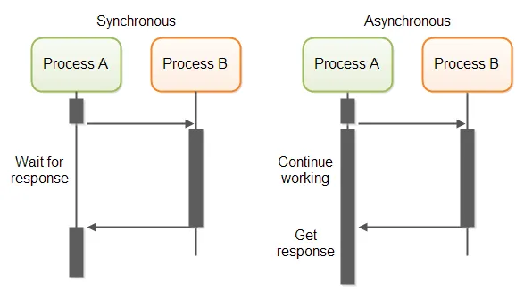

# Асинхронность

Синхронный (synchronous) режим — выполнение операций последовательно: когда одна операция вызывает другую и ждёт её завершения перед продолжением. То есть управление блокируется до получения результата.


Асинхронный (asynchronous) режим — выполнение операций организовано так, что одна задача может инициировать другую и не ждать её завершения — продолжать работать дальше. Результат другой операции приходит позже и обрабатывается отдельно (через колбэк, await, событие и т.д.).




Асинхронный ≠ параллельный.

Асинхронность имеет смысл только тогда, когда вызываемая задача выполняет долго не из-за того, что она требует много ресурсов, а из-за того, что она требует ожидания. Например при вводе\выводе или обращении к сети. В то время, как вызванная задача (Process A на рис. выше) ожидает, например, отклика по сети могут выполняться другие задачи (Process B на рис. выше).
 


## Что необходимо для работы асинхронности?
1. Возможность у функции "встать на паузу", чтобы дать другим функциям выполняться, например пока функция ждёт данные
    - Такой возможностью обладают специальный вид функций - корутины (coroutines)
2. Возможность в коде явно указать место, где функция может "встать на паузу"
    - `await`
3. Возможность отличать функции синхронные и асинхронные
    - для асинхронных функций используется `async`
4. Механизм, который может снимать функции с паузы, когда выполнилось некое условие, например пришли данные по сети и приостановленная функция может продолжить выполняться
    - организуется с помощью цикла событий (event loop)


# asyncio

**asyncio** предназначена для реализации асинхронного программирования, позволяющего писать эффективный и масштабируемый код для ввода-вывода (I/O) без блокировок. Это особенно полезно для:

* **Обработки большого числа одновременных сетевых соединений.**
* **Выполнения параллельных задач без необходимости создания потоков или процессов.**
* **Упрощения кода, работающего с асинхронными операциями**, благодаря конструкции `async/await`.

## asyncio и GIL

Python использует подход **Global Interpreter Lock (GIL)**, который ограничивает выполнение байт-кода в одном потоке в один момент времени. **asyncio** работает следующим образом:

* **Однопоточный подход.** Event loop (цикл событий) запускается в одном потоке. Это значит, что параллельное выполнение кода на уровне Python не происходит – задачи переключаются кооперативно.
* **Кооперативная многозадачность.** Вместо того, чтобы параллельно исполнять код, asyncio позволяет задачам добровольно уступать управление, когда они ждут результатов ввода-вывода (операция с ожиданием через `await`), давая возможность запускать другие задачи.
* **Интеграция с синхронным кодом.** Если необходимо выполнять вычислительно затратные или блокирующие операции, их можно запускать в отдельном потоке или процессе с помощью методов вроде `run_in_executor`, чтобы обойти ограничения GIL.

Таким образом, asyncio не отключает GIL, а работает в его рамках, используя кооперативное переключение между задачами.

Кооперативная многозадачность — вид многозадачности, когда переключение на задачи добровольное. Задача сама сообщает о том, что она будет приостановлена, например для ожидания данных, поэтому в это время могут выполнятся другие задачи. Вытесняющая многозадачность — многозадачность, когда приостановка задачи происходит не самой задачей, а планировщиком задач.


## Преимущества по сравнению с потоками и процессами

* **Меньшие накладные расходы:** Создание потоков или процессов может быть дорогостоящим по ресурсам. Asyncio использует корутины, которые легче в создании и управлении.
* **Упрощённая модель конкуренции:** Благодаря синтаксису `async`/`await` код выглядит линейным и легче для понимания по сравнению с callback-стилем или синхронной многопоточностью.
* **Высокая масштабируемость для I/O-bound задач:** Если основная нагрузка связана с операциями ввода-вывода, asyncio позволяет эффективно обрабатывать тысячи соединений без сложностей, связанных с блокировками потоков.
* **Контроль над временем выполнения:** Event loop позволяет гибко управлять планированием, задержками и тайм-аутами задач.

---

## Основные концепции asyncio

* **Event Loop (Цикл событий):** Центральный механизм, который управляет выполнением корутин, обработкой событий и распределением задач.
* **Корутины:** Функции, определённые с помощью `async def`, которые могут быть приостановлены оператором `await` и возобновлены позже.
* **Await:** Ключевое слово, позволяющее приостановить выполнение корутины до получения результата асинхронной операции.
* **Task:** Объект, представляющий запущенную корутину. Задачи планируются и выполняются циклом событий.
* **Future:** Объект, представляющий результат, который может стать доступным в будущем. Задачи часто используют Future для синхронизации.
* **Callbacks (Обратные вызовы):** Функции, вызываемые при завершении задач или наступлении определённых событий в event loop.
* **Non-blocking I/O:** Механизм ввода-вывода, который не блокирует выполнение программы, позволяя переключаться между задачами до получения результата операции.

---

## Пример использования

```python
import asyncio

async def fetch_data():
    print("Начало запроса")
    await asyncio.sleep(2)  # имитация долгой I/O операции
    print("Данные получены")
    return {"data": 123}


async def main():
    task1 = asyncio.create_task(fetch_data())
    task2 = asyncio.create_task(fetch_data())
    
    # Параллельное выполнение двух задач
    results = await asyncio.gather(task1, task2)
    print("Результаты:", results)

if __name__ == "__main__":
    asyncio.run(main())
```


